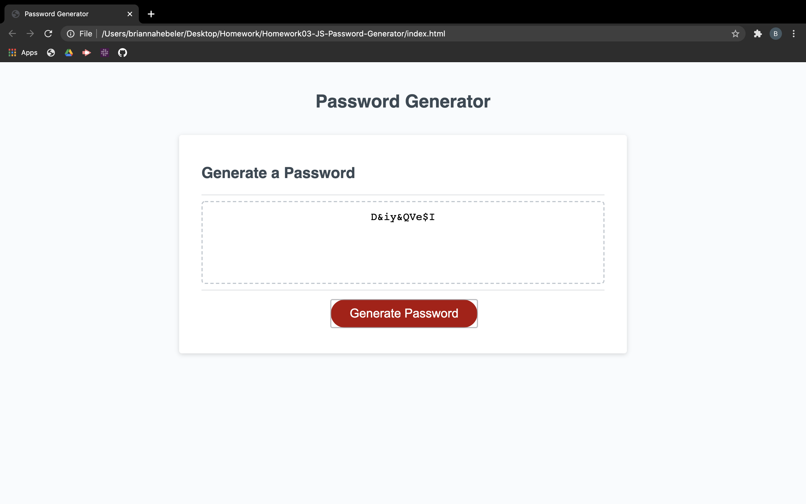

# Homework03-JS-Password-Generator

## Description: ##

* In this project my goal was to create an application to be used by the user to generate a randomized password based off multiple different factors

* When the user clicks the button they are prompted for password criteria
    * First, they are prompted to enter a password length between 8 and 128 characters. If answered incorrectly they will be alerted of their mistake and will continue to be prompted until they give an accurate amount of characters.
    * Secondly, they will be prompted to accept at least one type of character (numeric, lowercase, uppercase, symbol), and again if answered incorrectly, meaning they chose no character types, they will be alerted of their mistake and will continue to be prompted until they choose at least one character type.
* Once the user answers all of the prompt a random password is generated based off of the amount of characters and types of characters chosen and then displayed for the user on the webpage

## Screenshot: ##

## Link to deployed application: ##

https://briannahebeler.github.io/Homework03-JS-Password-Generator/